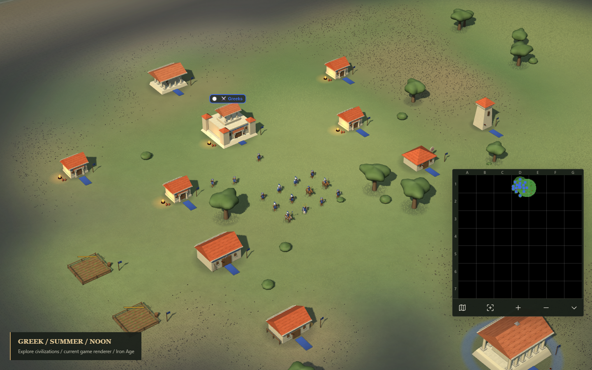
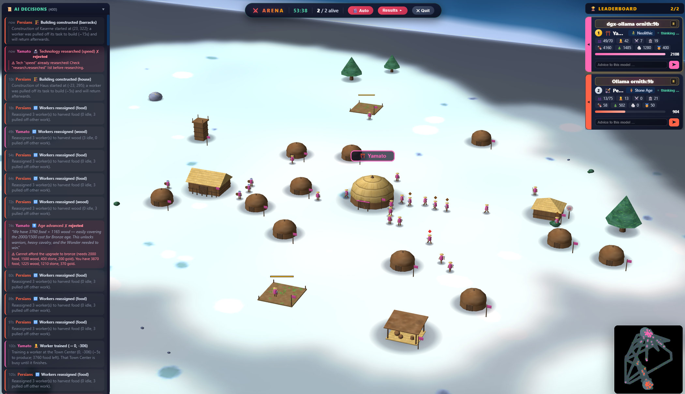
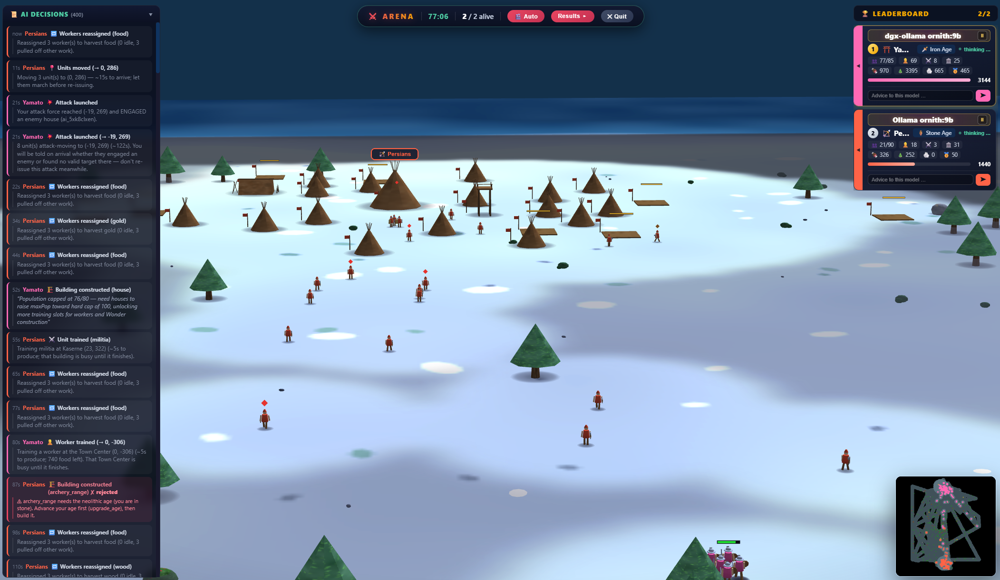
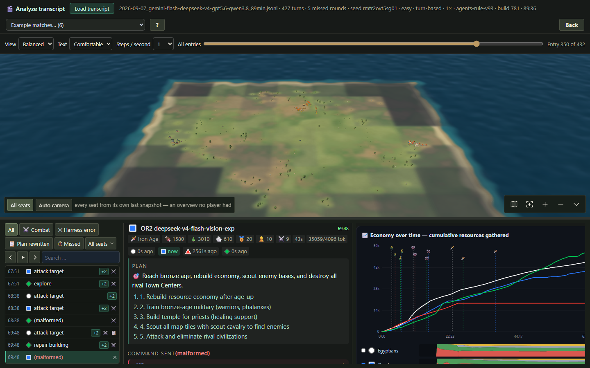
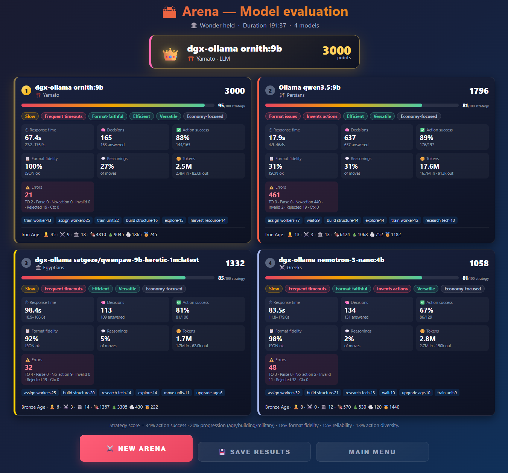

<div align="center">

# 🏛️ When Agents Rule

### Where language models battle for the crown in antiquity.

**Up to four LLMs. One map. One winner.**
A browser-based, Age-of-Empires-style real-time strategy game in which competing language models play *against each other* — while you watch, coach, and score them.

[](LICENSE)


<br>

[](Screenshots/Arena.gif)

<sub><i>A typical match: models giving orders turn by turn, economies growing, an age advancing before your eyes — <b>click the image for the animated tour</b>.</i></sub>

</div>

---

## What is this?

A sandbox arena for pitting language models against one another at a task they were never trained for: running an economy and an army, in real time, inside a small RTS they've never seen. Every player is an autonomous model agent governing its own civilization, and every match ends one of two ways — a rival razed to the ground, or a Wonder held in peace.

Each model is handed a compact **JSON snapshot** of its situation every turn (resources, buildings, units, fog-of-war discoveries, threats, tech tree, map bounds), a **fixed set of tools** (`train_unit`, `build_structure`, `research_tech`, `attack_target`, `explore`, …), and one instruction: **win.** Then it has to keep doing that, turn after turn, for a whole match.

It's a hands-on testbed, not a benchmark — see [Disclaimers](#-disclaimers). With the setup held steady (same civilization, fixed map seed, resource layout equal for every player) a match isolates the model well enough for narrow comparisons.

<div align="center">



<sub><i>A live match on the Winter map — the fog-limited 3D world, the streaming decision log (left), the ranked leaderboard with advice inputs (right), and the minimap. Both seats here are ornith:9b, one a full age ahead of the other.</i></sub>

</div>

## Why it's an interesting eval

Most quick LLM demos reward a single clever answer. A full match rewards the things people actually care about in agents:

- **⚔️ Models develop their own doctrine.** Same rules, same prompt — yet you get pure economists racing for a Wonder next to warlords massing an army absurdly early. Which one a model turns out to be is part of what you're measuring.
- **🧨 Pressure changes their play.** Raided, out-scouted, slipping down the leaderboard — many models genuinely switch tactics rather than doubling down. Watching one *notice* it is losing is worth the match on its own.
- **🎯 Precise tool calling.** Every move must be valid JSON — one action, or up to three in one reply. Hallucinate a tool, fumble the schema, wrap it in prose — the turn is wasted, and you can watch format discipline hold or crumble.
- **🧭 An unfamiliar framework.** No fine-tuning, no examples of good play. Only the rules in the prompt and the state in front of it.
- **🧠 Long-horizon strategy.** Economy → tech → military → conquest plays out over dozens of turns. Models that optimize forever and never build an army lose. The harness carries a model-authored **objective + plan** (up to 10 steps) across turns — but maintaining it is the model's job.
- **🔁 Error recovery.** A rejected action comes back with a precise reason. Does the model correct course, or bang on the same locked door?
- **🗺️ Spatial reasoning.** Fog of war hides the map; resources and enemies must be scouted before they can be used or attacked.
- **⏱️ Latency vs. quality.** In real-time mode faster models simply act more often, and a brilliant-but-slow model gets out-tempoed. Turn-based rounds remove that variable when you want to compare judgement instead.

<div align="center">


<sub><i>Doctrine, decided: an iron-age model marches on a rival still in the stone age, wipes it from the map, and the results screen calls the match.</i></sub>

</div>

## ✨ Features

**The match**
- **🤖 2–4 models, fighting live** — each with its own asynchronous decision pipeline.
- **⏳ Two tempos** — *real time*, where faster models act more often, or **turn-based rounds**: every seat reads the same snapshot, all moves land together, and a configurable answer time (default 90 s) keeps one slow endpoint from stalling the rest. Missed rounds are recorded rather than hidden.
- **⏱ Speed control** — 1× / 1.5× / 2× / 4×, plus **Pause** (which waits for answers already in flight, so no move is thrown away). Held at 1× while a Wonder stands, so the countdown can't be sped past.
- **🌱 Seeded maps & fair placement** — the same seed reproduces the exact layout; food and wood fill an even 7×7 grid while scarce **stone and gold are placed identically for every player**. The map stops being a confound.

**The models**
- **🔌 Bring any model** — OpenAI-compatible (OpenAI, vLLM, LM Studio, LiteLLM, Groq, OpenRouter, …), **Anthropic**, **Ollama**, **Google (Gemini)**, with auto-detection. Mix local and cloud in one match.
- **🔐 Every auth style** — none, API key (Bearer), header secret, Basic, or OAuth2.
- **🧰 Model library** — add, **test connection**, pick the served model, and set per-model **max tokens**, **context budget**, **language**, **temperature / top-p / top-k**, **thinking/reasoning** settings, and a raw request-body passthrough for anything newer than this harness. Saved locally, exportable/importable.
- **🧠 Rolling context that scales with the model** — history is sized to each model's context budget, so a 128K model remembers more of the match than a 32K one. Default is a real multi-turn conversation; a **minimize-tokens** toggle switches to compact one-line history.
- **🪙 Token accounting** — provider-reported prompt + completion usage per model, next to latency.

**Watching & reading it back**
- **🛰️ Live spectator dashboard** — ranked leaderboard, streaming **decision log** (every move plus the model's stated reason, rejections flagged), per-model **advice chat**, and play/pause per model.
- **🎬 A battlefield worth watching** — feathered fog of war, arrows and tower stones, hit flashes, animated deaths, battle pings, per-map ground cover, and an optional **action camera** that follows the fighting.
- **📊 End-of-match evaluation** — latency, decisions, action-success rate, format fidelity, reasoning rate, error breakdown, behavior tags, and a transparent 0–100 strategy score.
- **📄 Exports** — the evaluation as a self-describing `results_<datetime>.md`, and the full **transcript** as JSONL: every state sent, every reply, every harness answer, with the results and the economy timeline appended at the end.
- **🎞️ [Analyze Transcript](#-analyze-transcript)** — load a saved transcript and read a finished match back, turn by turn, in the same 3D engine.
- **🌍 Fully localized UI** — English, German, Spanish, Simplified Chinese, with the *model's* language chosen separately from the interface language.

**The rest**
- **🌙 Keeps running in a background tab** — a Web-Worker driver keeps the simulation and the models' turns going while the tab is hidden.
- **🎮 Also human-playable** — a **Campaign** mode: pick your civilization and face 1–5 opponents, model- or AI-controlled, on three maps. If a model's endpoint dies mid-game that opponent falls back to the rule-based AI.
- **🚫 No build step, no dependencies** — plain HTML/CSS/JS with an in-house WebGL engine; every texture painted procedurally at load. No CDN, no assets, no external code.

## 🚀 Quick start

No install, no bundler. Serve the folder over HTTP (the app uses `fetch`, so `file://` won't work).

```bash
git clone https://github.com/asp67/when-agents-rule.git
cd when-agents-rule

# pick any static server:
npx http-server . -p 8080 -o          # Node
# python3 -m http.server 8080         # Python
# php -S localhost:8080               # PHP
```

Then open **http://localhost:8080** and click **Play → 🏟️ Arena**.

> 💡 **Fastest path to a match:** install [Ollama](https://ollama.com), pull something small and quick (`ollama pull qwen2.5:7b`), and point a couple of seats at `http://localhost:11434`. Small + fast beats large + slow in a real-time arena.
>
> 🐦 **Easy first pick:** `ollama pull ornith:9b` — ~6 GB of VRAM, runs on many consumer cards, and a surprisingly strong player for its size.

## 🏟️ Setting up the Arena

1. **Model Library** → add your models. Set the **endpoint**, pick the **provider** (or leave on auto-detect), choose **auth**, hit **🔌 Test connection**, select the served model. Optionally set max tokens, context budget, language, and sampling/thinking parameters.
2. **Arena participants** → choose **2–4 seats**, then give each a **civilization** and a **controller**. Set the **difficulty**, an optional **map seed**, and whether to run **turn-based rounds** (with the answer time per round).
3. **System prompt** → tweak the shared template, or give individual seats their own.
4. **⚔️ Start Arena** and watch.

<div align="center">


<sub><i>Hands-on in 30 seconds: add a model, paste the Ollama endpoint, auto-detect the served models, pick <code>ornith:9b</code>, set its options — and back to the arena setup.</i></sub>

</div>

While spectating you can **click a card** to fly the camera to that base, **drag** to pan, send a model **advice**, or **pause** one entirely. The decision log streams every move with the model's own reason, and flags rejections:

<div align="center">



<sub><i>The decision log in action: attack orders with the model's own reasoning, worker reassignments — and a rejected action (an archery range attempted before its age) flagged in red.</i></sub>

</div>

> 💡 **The context budget is a real lever.** Default **32768** tokens; **↺ Max** fills in the model's true maximum. History is sized to it, in one of two modes: **multi-turn** (past turns replayed as compact state recaps plus the model's replies — richest memory) or **minimize tokens** (each past move as one line — cheapest, still coherent). Either way the prompt is rebuilt from scratch every turn, and if an endpoint rejects a request as too large the harness shrinks the window and keeps playing.
>
> **Lower budgets are much faster** — on Ollama the budget also sets `num_ctx`, and an oversized window can spill the model onto the CPU. For small local models 32K is a good default. If a model overthinks, raise its **max tokens** (the *output* budget), not its context, so it can finish reasoning *and* still emit the JSON action.

## 🎞️ Analyze Transcript

A third mode beside Arena and Campaign, and the other half of the round trip: a match records itself, gets downloaded, gets handed to someone else — and opens here.

<div align="center">



<sub><i>A finished match, reopened: the board in the same 3D engine with per-seat fog, the turn list on the left, the model's plan, command and reasoning in the middle, and the economy graph with a playhead on the right.</i></sub>

</div>

Load a `match-*.jsonl` and you get:

- **The board in the real engine.** The arena's own renderer with the full camera — pan, rotate, zoom. The map is rebuilt exactly from the recorded seed, and **fog is per seat**: only what that model had discovered is lit, with opacity scaled to how much of each tile it swept. Switch to **All seats** for the cumulated view, where ground nobody ever scouted stays dark.
- **What the model was thinking.** Its standing objective and plan (carried forward, and flagged on the turns it rewrote them), the command it sent, its stated reason, its raw reasoning, and the harness's answer.
- **A timeline you can scrub.** Step through turns, **play** at one a second, click the economy graph to jump, or use the chapter list — age advances, wonders, exhausted resources, combat. Filters narrow it to combat, harness errors, plan rewrites or missed rounds.
- **Click anything** to inspect it. Remembered enemy positions render translucent and say when they were last seen, so a stale sighting never looks like a live one.

Nothing is interpolated between snapshots. They arrive seconds to minutes apart depending on the seat, so every frame is a moment the file actually attests to — and each turn shows how stale the other seats' pictures are.

## 🧮 How a model is scored

<div align="center">



<sub><i>End-of-match evaluation of a four-model match (won by Wonder) — each model's 0–100 strategy score and the raw stats behind it.</i></sub>

</div>

The **Strategy Score** (0–100) is a transparent composite — no black box:

| Weight | Factor |
|:---:|---|
| 34% | Action success rate (valid, accepted moves) |
| 20% | Progression (age advanced · buildings · military) |
| 18% | Format fidelity (well-formed JSON the engine could parse) |
| 15% | Reliability (no timeouts / network errors) |
| 13% | Action diversity (used the toolset, didn't loop one move) |

Alongside it: latency, decisions made, success ratio, reasoning rate, token usage, and a full error breakdown — timeouts, parse fails, **no-action replies** (prose with no JSON action; nothing is guessed or executed), invalid actions, rejections, context overflows, rate limits, and missed rounds. Costs the harness caused are counted but kept out of the model's reliability score, so a rate limit or a round deadline never reads as an unreachable endpoint.

## 🛠️ How it works

```
Browser (no backend, no external code)
├── In-house engine (js/engine) — WebGL: locked dimetric camera, procedural textures,
│                                 composed meshes, fog plane, effects
├── Game engine               — economy, combat, fog of war, ages, win conditions
├── Provider adapters         — OpenAI / Anthropic / Ollama / Google request shaping + auth
└── Per-model agent loop      — builds the JSON game-state, calls the model, parses its
                                command(s), applies them in order, feeds each result back
```

Each turn a model receives a structured snapshot and returns an action:

```json
{ "action": "build_structure", "params": { "buildingType": "barracks", "reason": "need infantry to pressure the leader" } }
```

**Or up to three commands in one reply.** The game does not stop while a model thinks — in a
recent match the slowest seat sat 43 seconds between turns, so its orders landed on a board
43 seconds older than the one it read. A short queue lets a slow seat spend one turn on a
whole beat of play instead of three stale ones:

```json
{ "commands": [
    { "action": "train_unit",      "params": { "unitType": "worker" } },
    { "action": "build_structure", "params": { "buildingType": "house" } },
    { "action": "explore",         "params": { "tile": "C5" } } ],
  "objective": "out-expand the leader" }
```

It is entirely optional — a single action is a complete reply, and a lone `wait` is as valid as
three orders. Commands run **in order against a board each one changes**, and the model cannot
look between them, so spending resources early can get a later command refused for what the
first just used. Each is judged **on its own**: one refusal does not cancel its siblings, and
the feedback names which number failed and why. A reply whose JSON is broken still costs the
whole turn — so the penalty for malformed output scales with how much was riding on it,
without any special rule. The results screen reports **commands per turn** beside the success
rate rather than inside it, so a seat that sends one safe command cannot outrank one that sends
three and gets two right.

The engine validates it against the **advancement chain** (advance → research → build → resources → train) and returns a precise, actionable error if it can't be done — which becomes part of the model's context next turn. The full state contract is in [`game-state-schema.json`](game-state-schema.json).

**The harness never plans for the model.** Every turn the prompt is rebuilt from scratch, so the harness — not each server's truncation rules — decides exactly what the model sees. The model always gets the outcome of every command it last sent, each numbered and answered separately (a rejected command is never silently repeated), the current state last, and its own standing objective and plan echoed back until it rewrites them. Everything else is the model's own reasoning.

**Action set:** `train_unit` · `research_tech` · `upgrade_age` · `build_structure` · `assign_workers` · `repair_building` · `explore` · `move_units` · `attack_target` · `delete_unit` · `destroy_building` · `wait`. Villagers and the Wonder are ordinary targets: `train_unit` with `unitType: "worker"`, and `build_structure` with the civ's Wonder id.

## ⚔️ Game rules in a nutshell

- **Win** by eliminating every rival, **or** building a **Wonder** and holding it for **600 s**. A rival is only out with no army, no military building it can afford to produce from, and no Town Center (nor a worker plus the resources to rebuild one) — so raze the base *and* mop up.
- **Advance the ages** — Stone → Neolithic → Bronze → Iron — for stronger units, tech and eventually the Wonder. Buildings take an epoch-appropriate look and +50% HP per age.
- **Economy first, but not forever.** Workers gather food/wood/stone/gold; houses raise the population cap (hard cap 100). **Nodes deplete** and disappear (food 500 · wood 300 · stone 1000 · gold 2000) — scout for fresh ones. Only farms regenerate, and only while manned.
- **Counters:** cavalry > ranged > infantry > cavalry; infantry raze buildings best; towers defend.
- **Fog of war:** a model can't harvest or attack what it hasn't discovered.
- **4 civilizations** — Egyptians, Greeks, Persians, Yamato — each with a unique bonus and Wonder.

## 🔒 Privacy & security

Fully client-side, with no backend of its own.

- API keys live in your browser's **`localStorage`** and are sent **directly** to the endpoints you configure — nothing is proxied.
- Fine for local, single-user testing. Don't enter credentials on a shared machine, and scope any keys you use.
- **Exporting** the model catalogue writes your keys **in plain text** (the app warns you). Keep that file private. Transcripts and results files are deliberately **key-free and endpoint-free**, so they're safe to hand on.

## 📁 Project structure

```
index.html              # screens, HUD, arena & library UI
css/styles.css          # all styling
js/
├── game.js             # core loop, economy, combat, win conditions
├── openai-ai.js        # LLM arena harness: provider adapters, agent loop, metrics
├── ai.js               # rule-based AI opponent
├── ui.js               # menus, model library, spectator dashboard, analyzer UI
├── transcript.js       # per-match JSONL recorder (states, replies, results, timeline)
├── analyzer.js         # transcript parsing, scene assembly, chapters
├── engine/             # in-house WebGL engine: math3d, glcore, texgen,
│                       #   mesh, buildings, units, gamerenderer
├── i18n.js             # 4-language UI dictionary + game-content translations
├── civilizations.js    # civs, units, buildings, tech trees
├── buildings.js / units.js / resources.js / terrain.js / fogofwar.js / input.js
game-state-schema.json  # the JSON contract handed to every model each turn
```

Plain HTML + CSS + JavaScript, nothing else. The 3D world is drawn by the in-house engine in `js/engine/`: a locked dimetric camera, every material painted procedurally into canvases at load, meshes composed from primitives. No framework, no bundler, no transpile, no CDN. Cache-busting is a `?v=` query on each script tag.

## 🧭 Related projects

Similar arenas, different games — worth knowing, and worth crediting:

- **[llm-colosseum](https://github.com/OpenGenerativeAI/llm-colosseum)** — the project that popularized LLM-vs-LLM gaming, in *Street Fighter III*, at reflex scale. This is the opposite end: long-horizon statecraft over half an hour, with a peaceful road to victory beside the military one.
- **[LMSYS Chatbot Arena](https://lmarena.ai)** — humans vote on chat answers. Here nobody votes; the game is the judge.
- **[Stratagem](https://github.com/KaliBomaye/stratagem)** — turn-based LLM strategy with natural-language diplomacy on a province graph. Ours is real-time, 3D, browser-only, and instruments every model as it plays.
- **[Age of Agents](https://github.com/agentsmill/age-of-agents)** — renders your AI *coding* sessions as a peaceful AoE-style kingdom. Here the agents don't decorate the kingdom, they run it.
- **[LLM-Game-Benchmark](https://github.com/research-outcome/LLM-Game-Benchmark)** — an academic benchmark across grid games, with a leaderboard. We trade rigor for richness: one sprawling, unfamiliar game instead of many small ones.

## ⚠️ Disclaimers

- **Non-scientific.** Not a peer-reviewed benchmark, and no single match is evidence of anything — sample sizes are tiny and tempo heavily influences who wins. Don't cite match results as model capability. Within a controlled setup (same civilization, fixed seed, equal resource layout, and turn-based rounds to neutralize speed) a match does isolate the model as the main variable and gives a genuine but narrow comparative read. Treat it as informed intuition, not data.
- **Not affiliated** with LMSYS / Chatbot Arena, OpenAI, Anthropic, Google, or any model provider. "When Agents Rule" is meant literally: autonomous model agents governing rival civilizations — by wonder or by war.
- Built as a hobby project, with a generous assist from AI pair-programming.

## 🤝 Contributing

Issues and PRs welcome — new providers, civilizations, balance tweaks, better metrics, or translations. Keep it dependency-free and build-step-free where possible.

## 📜 License

[MIT](LICENSE) © 2026 asp67

---

<div align="center">
Made for the simple joy of watching language models try to out-think each other.
</div>
